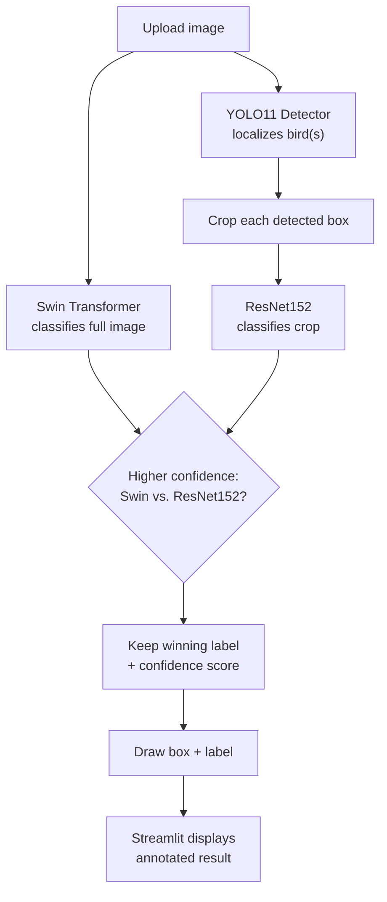
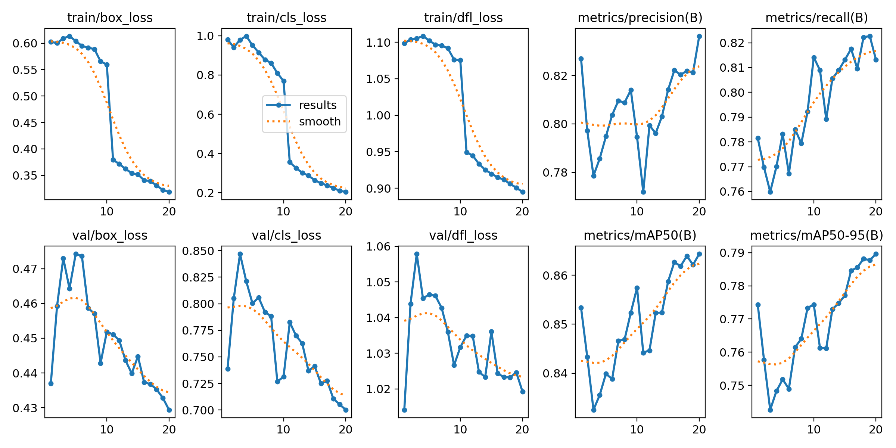
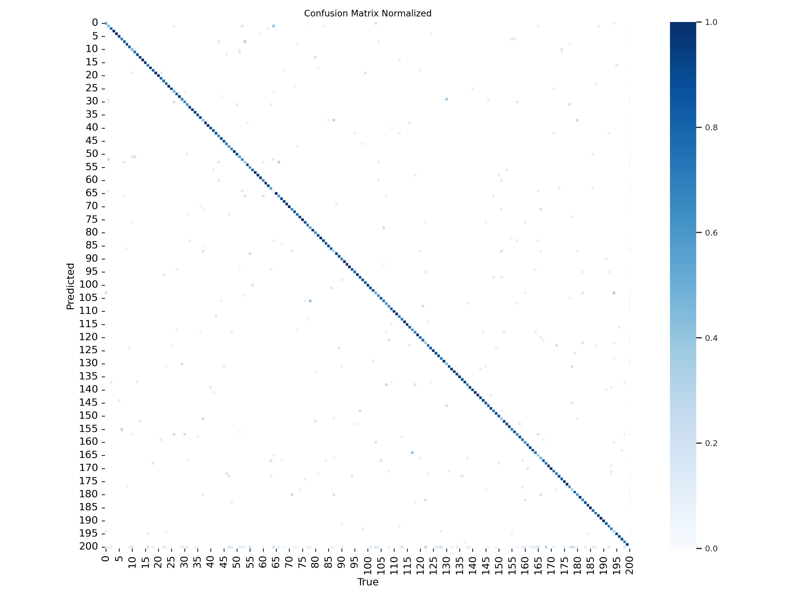
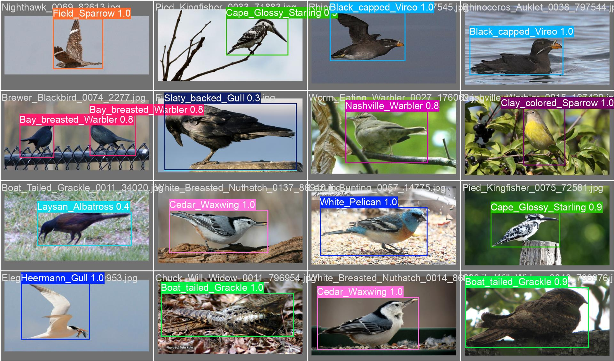
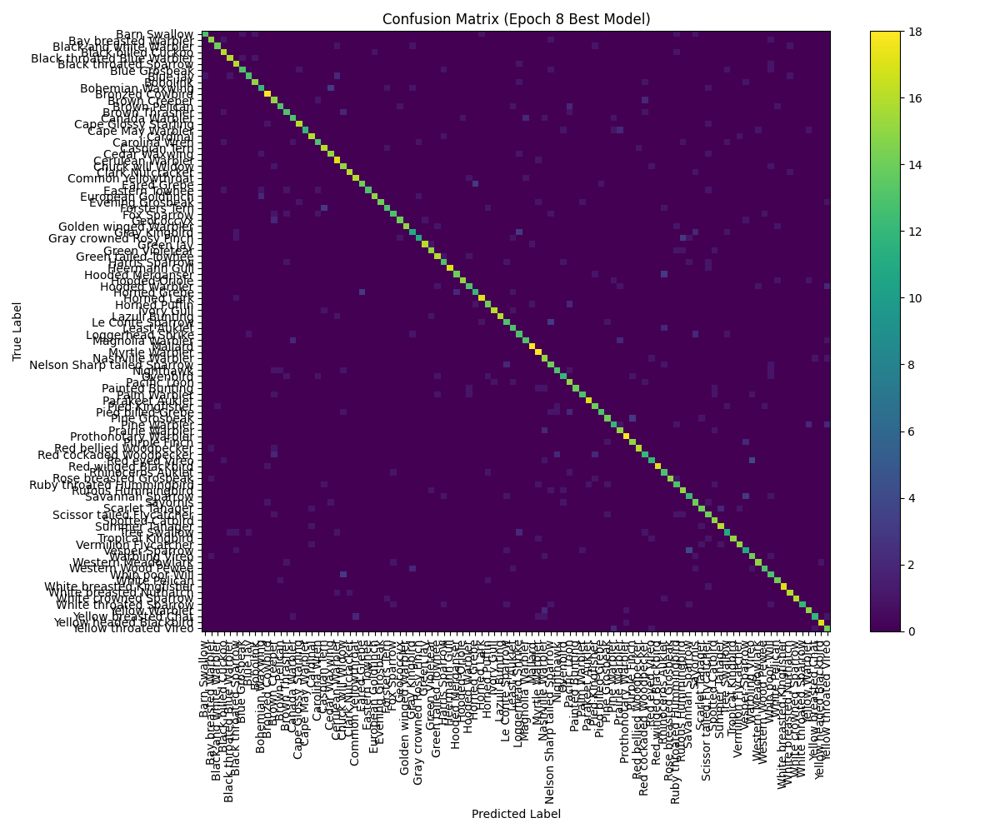

<div align="center">

# 🐦 Bird Species Classification

**Detect birds in a photo and identify their species** — a two-stage computer vision pipeline that pairs a fine-tuned **YOLO11** detector with an ensemble of a custom **ResNet152** classifier and a pretrained **Swin Transformer**, served through an interactive **Streamlit** app.


</div>

---

## Quick Start

```bash
git clone https://github.com/Arpit-Shukla-20233080/Bird-Species-Classification.git
cd Bird-Species-Classification

pip install -r requirements.txt

# Add model weights to models/ — see "Model Weights" below
streamlit run app.py
```

## Table of Contents

- [Overview](#overview)
- [How It Works](#how-it-works)
- [Results](#results)
- [Project Structure](#project-structure)
- [Getting Started](#getting-started)
  - [Prerequisites](#prerequisites)
  - [Installation](#installation)
  - [Model Weights](#model-weights)
  - [Running the App](#running-the-app)
- [Reproducing the Pipeline](#reproducing-the-pipeline)
- [Supported Species](#supported-species)
- [Tech Stack](#tech-stack)
- [Roadmap](#roadmap)
- [Limitations](#limitations)
- [Contributing](#contributing)
- [License](#license)
- [Acknowledgements](#acknowledgements)
- [Support](#support)
- [Team](#team)

## Overview

Fine-grained bird species identification is a hard visual classification problem — hundreds of species differ only in subtle plumage, bill shape, or markings, while background, pose, and lighting vary far more than the birds themselves. This project addresses that in two stages, similar to how a birder would approach it: first find the bird in the frame, then take a close look to identify the species.

1. **Detect** — a YOLO11 model, fine-tuned on [CUB-200-2011](http://www.vision.caltech.edu/datasets/cub_200_2011/) bounding-box annotations, locates every bird in the uploaded image.
2. **Classify** — each detected region is cropped and passed to a ResNet152 fine-tuned on a curated 100-species subset of CUB-200-2011. In parallel, a pretrained Swin Transformer classifies the full image. Whichever prediction carries higher confidence is kept.
3. **Serve** — the pipeline is wrapped in a Streamlit app: upload a photo, and the app draws bounding boxes with the predicted species and confidence score directly on the image.

<!--
📸 Add a screenshot or short GIF of the running app here once you have one, e.g.:

-->

## How It Works



A few implementation details worth knowing before you dig into the code:

- **YOLO11 is used purely as a localizer.** It was trained as a full 200-class species detector, but `app.py` only reads its bounding-box coordinates (`results[0].boxes.xyxy`) — the final species label always comes from ResNet152 or Swin, never from YOLO's own class prediction.
- **The Swin prediction is computed once per image**, on the full uploaded photo, and then compared against *every* detected box. On multi-bird images, the same global prediction can therefore "win" more than one box.
- **The higher-confidence model wins per box.** There's no weighted averaging — it's a simple `argmax` over two independent confidence scores.

## Results

### Object Detection (YOLO11)

The detector was fine-tuned on CUB-200-2011 bounding boxes (Pascal VOC → YOLO format), split 70 / 20 / 10 into train / val / test.

| | |
|---|---|
| Model | YOLO11-Large (Ultralytics), 25.4M params, 87.4 GFLOPs |
| Classes | 200 (CUB-200-2011 species) |
| Train / Val / Test images | 8,250 / 2,358 / 1,179 (11,787 annotations total) |
| Image size | 512 × 512 |
| Epochs | 20 (fine-tuned from a checkpoint already trained for 25 epochs) |
| Training time | ~1.5 hours on a single Tesla T4 (Kaggle) |
| **Precision** | **0.838** |
| **Recall** | **0.812** |
| **mAP@0.5** | **0.864** |
| **mAP@0.5:0.95** | **0.790** |



 

Full metrics per epoch (`results.csv`) and precision/recall/F1 curves are in [`object_detection_results/`](object_detection_results/).

### Species Classification (ResNet152)

The classifier was fine-tuned on a curated, augmented 100-species subset of CUB-200-2011 (cropped to ground-truth bounding boxes, plus rotation/flip/brightness and edge-sharpening/background-blur augmentations).

| | |
|---|---|
| Model | ResNet152 (torchvision), final FC layer replaced for 100 classes |
| Classes | 100 (curated subset — see [Supported Species](#supported-species)) |
| Train / Test images | 7,108 / 1,787 |
| Input size | 256 × 256, ImageNet normalization |
| Optimizer | AdamW (lr = 1e-3), StepLR (γ = 0.1 every 7 epochs) |
| Best epoch | 8 of 10 (fine-tuning run resumed from a checkpoint already trained for 15 epochs) |
| **Test accuracy** | **80.25%** |
| Macro avg F1 | 0.804 |
| Weighted avg F1 | 0.804 |



Full per-class precision/recall/F1 is in [`classification_results/classification_report_epoch8.txt`](classification_results/classification_report_epoch8.txt).

### Ensemble Partner (Swin Transformer)

[`Emiel/cub-200-bird-classifier-swin`](https://huggingface.co/Emiel/cub-200-bird-classifier-swin) is a `swin-large-patch4-window12-384-in22k` model fine-tuned on CUB-200-2011 for the "Feather in Focus!" Kaggle competition (University of Amsterdam), reporting ~88% test accuracy across all 200 species. It's pulled in via `transformers.pipeline` and used to classify the full image, extending species coverage beyond ResNet152's 100-class subset and providing a fallback when detection or cropping goes wrong.

## Project Structure

```text
Bird-Species-Classification/
├── 1.Visualise_the_data__Caltech_birds.ipynb       # EDA on the full 200-class dataset
├── 2.yolo-object-detection.ipynb                   # VOC→YOLO conversion + YOLO11 training
├── 3.data_preprocessing_for_classification.ipynb   # Crop, augment, build classifier dataset
├── 4.data_preprocess_for_100_classes.ipynb         # Filter down to the curated 100 classes
├── 5.ResNet_Classification_Model_Training.ipynb    # ResNet152 fine-tuning + evaluation
├── 6.app.py                                        # Streamlit app (numbered copy)
├── app.py                                          # Streamlit app (deployment entry point)
├── requirements.txt
├── classification_results/
│   ├── classification_report_epoch8.txt
│   ├── confusion_matrix_epoch8.csv
│   └── confusion_matrix_epoch8.png
├── object_detection_results/
│   ├── results.csv / results.png
│   ├── confusion_matrix.png / confusion_matrix_normalized.png
│   ├── P_curve.png / R_curve.png / F1_curve.png / PR_curve.png
│   └── val_batch*_labels.jpg / val_batch*_pred.jpg
└── models/                       # not included in this repo — see Model Weights
    ├── epoch45.pt
    └── model_state_dict_best.pth
```

> `6.app.py` and `app.py` are identical. `app.py` sits at the repo root as the deployment entry point (many platforms default to looking for `app.py`), while `6.app.py` keeps a copy in sequence with the numbered notebooks that produced it.

## Getting Started

### Prerequisites

- Python 3.9+ (developed and tested against 3.10.12)
- pip
- A CUDA-capable GPU is recommended but not required — the app also runs on CPU, just slower
- Git

### Installation

```bash
git clone https://github.com/Arpit-Shukla-20233080/Bird-Species-Classification.git
cd Bird-Species-Classification

python -m venv venv
source venv/bin/activate        # Windows: venv\Scripts\activate

pip install -r requirements.txt
```

### Model Weights

This repository includes code and evaluation artifacts, but not the trained model binaries — they're large and typically kept out of version control. Before running the app, create a `models/` folder at the project root containing:

| File | Used by | Produced by |
|---|---|---|
| `models/epoch45.pt` | YOLO11 detector | `2.yolo-object-detection.ipynb` |
| `models/model_state_dict_best.pth` | ResNet152 classifier | `5.ResNet_Classification_Model_Training.ipynb` |

The Swin Transformer needs no manual download — `transformers` fetches and caches [`Emiel/cub-200-bird-classifier-swin`](https://huggingface.co/Emiel/cub-200-bird-classifier-swin) from the Hugging Face Hub automatically on first run.

If you don't have these files yet, retrain them using the notebooks below, or drop in your own weights with matching filenames and shapes.

### Running the App

```bash
streamlit run app.py
```

Open the local URL Streamlit prints (defaults to `http://localhost:8501`), upload a `.jpg` / `.jpeg` / `.png` photo, and the app will draw a bounding box with the predicted species and confidence score.

> **CPU vs. GPU:** `app.py` loads ResNet152 onto CPU by default (`load_resnet_model(..., device="cpu")`). If a CUDA GPU is available, change this argument to `"cuda"` for faster inference.

## Reproducing the Pipeline

Run the notebooks in order to reproduce the full pipeline from raw data to trained weights:

| # | Notebook | What it does |
|---|---|---|
| 1 | `1.Visualise_the_data__Caltech_birds.ipynb` | EDA on the full 200-class CUB-200-2011 set: sample visualization, augmentation preview, per-class train/test sampling balance, corrupted-image checks. |
| 2 | `2.yolo-object-detection.ipynb` | Converts Pascal VOC XML annotations to YOLO format, splits 70/20/10, and fine-tunes YOLO11-Large for 20 epochs at 512px. |
| 3 | `3.data_preprocessing_for_classification.ipynb` | Crops birds using ground-truth bounding boxes, applies per-class augmentation and edge-sharpening/background-blur variants, and assembles an 80/20 `ImageFolder`-style dataset. |
| 4 | `4.data_preprocess_for_100_classes.ipynb` | Filters the full 200-class classification dataset down to the curated 100-species subset. |
| 5 | `5.ResNet_Classification_Model_Training.ipynb` | Fine-tunes ResNet152 on the 100-class dataset, checkpoints on validation-accuracy improvements, and exports the best weights plus a full evaluation report. |
| 6 | `6.app.py` / `app.py` | The Streamlit inference app described above. |

> **Note:** These notebooks were developed on Kaggle (and notebook 3 locally on Windows), so they contain hard-coded input paths (`/kaggle/input/...`, `C:\...`). Update the path variables near the top of each notebook to point at your own copy of the data before re-running.

> **Extra dependencies:** `requirements.txt` covers the Streamlit app only. The notebooks additionally require `opencv-python`, `pandas`, `holoviews`, `hvplot`, `bokeh`, `imutils`, and Jupyter itself. Notebook 1 also imports a local `cub_tools` helper package (from [ecm200/caltech_birds](https://github.com/ecm200/caltech_birds)) that isn't bundled in this repo — treat it as a reference notebook rather than a plug-and-run step unless you install that package separately.

## Supported Species

The deployed ResNet152 classifier recognizes these 100 species (YOLO detects all 200 CUB-200-2011 species for localization purposes, and the Swin ensemble partner extends classification coverage to the full 200-class taxonomy):

<details>
<summary>Click to expand the full list</summary>

| Species | Species | Species | Species |
|---|---|---|---|
| Barn Swallow | Eared Grebe | Loggerhead Shrike | Ruby throated Hummingbird |
| Bay breasted Warbler | Eastern Towhee | Magnolia Warbler | Rufous Hummingbird |
| Black and white Warbler | European Goldfinch | Mallard | Savannah Sparrow |
| Black billed Cuckoo | Evening Grosbeak | Myrtle Warbler | Sayornis |
| Black throated Blue Warbler | Forsters Tern | Nashville Warbler | Scarlet Tanager |
| Black throated Sparrow | Fox Sparrow | Nelson Sharp tailed Sparrow | Scissor tailed Flycatcher |
| Blue Grosbeak | Geococcyx | Nighthawk | Spotted Catbird |
| Blue Jay | Golden winged Warbler | Ovenbird | Summer Tanager |
| Bobolink | Gray Kingbird | Pacific Loon | Tree Swallow |
| Bohemian Waxwing | Gray crowned Rosy Finch | Painted Bunting | Tropical Kingbird |
| Bronzed Cowbird | Green Jay | Palm Warbler | Vermilion Flycatcher |
| Brown Creeper | Green Violetear | Parakeet Auklet | Vesper Sparrow |
| Brown Pelican | Green tailed Towhee | Pied Kingfisher | Warbling Vireo |
| Brown Thrasher | Harris Sparrow | Pied billed Grebe | Western Meadowlark |
| Canada Warbler | Heermann Gull | Pine Grosbeak | Western Wood Pewee |
| Cape Glossy Starling | Hooded Merganser | Pine Warbler | Whip poor Will |
| Cape May Warbler | Hooded Oriole | Prairie Warbler | White Pelican |
| Cardinal | Hooded Warbler | Prothonotary Warbler | White breasted Kingfisher |
| Carolina Wren | Horned Grebe | Purple Finch | White breasted Nuthatch |
| Caspian Tern | Horned Lark | Red bellied Woodpecker | White crowned Sparrow |
| Cedar Waxwing | Horned Puffin | Red cockaded Woodpecker | White throated Sparrow |
| Cerulean Warbler | Ivory Gull | Red eyed Vireo | Yellow Warbler |
| Chuck will Widow | Lazuli Bunting | Red winged Blackbird | Yellow breasted Chat |
| Clark Nutcracker | Le Conte Sparrow | Rhinoceros Auklet | Yellow headed Blackbird |
| Common Yellowthroat | Least Auklet | Rose breasted Grosbeak | Yellow throated Vireo |

</details>

## Tech Stack

| Category | Technology |
|---|---|
| Language | Python 3.9+ |
| Deep learning | PyTorch, torchvision |
| Object detection | Ultralytics YOLO11 |
| Classification backbone | ResNet152 (custom fine-tune) |
| Ensemble partner | Swin Transformer (Hugging Face Transformers) |
| Web app | Streamlit |
| Data / ML utilities | scikit-learn, NumPy, Pandas, OpenCV, Pillow |
| Experimentation | Jupyter notebooks, Kaggle GPU runtime |

## Roadmap

- [ ] Host trained weights (Git LFS / Hugging Face Hub / cloud storage) with an automated download script
- [ ] Containerize the app (`Dockerfile`) for reproducible deployment
- [ ] Add CI (linting + a smoke test for the Streamlit app)
- [ ] Unit tests for the pre/post-processing utilities
- [ ] Extend the classifier from 100 to the full 200-class CUB-200-2011 taxonomy
- [ ] Add a batch / REST inference endpoint (e.g. FastAPI) alongside the Streamlit UI
- [ ] Per-box confidence calibration (currently one full-image Swin prediction is compared against every detected box)
- [ ] Pin exact dependency versions — `requirements.txt` currently specifies lower bounds only

## Limitations

- ResNet152 recognizes only the 100 curated species it was trained on; the Swin partner covers the full 200-species CUB-200-2011 taxonomy, but both are limited to species present in that dataset — birds outside it will always be mis-classified as the closest known species.
- YOLO's own species predictions are discarded in `app.py`; only its bounding boxes are used, so detection quality (not YOLO's classification) drives what gets cropped and fed to ResNet152.
- Trained and evaluated primarily on CUB-200-2011 imagery — mostly clear, single-bird photographs — so accuracy will likely drop on cluttered scenes, heavy occlusion, poor lighting, or multiple overlapping birds.
- `requirements.txt` covers the Streamlit app only; see [Reproducing the Pipeline](#reproducing-the-pipeline) for the extra packages the notebooks need.

## Contributing

Contributions are welcome:

1. Fork the repository
2. Create a feature branch (`git checkout -b feature/your-feature`)
3. Commit your changes (`git commit -m "Add your feature"`)
4. Push to your branch (`git push origin feature/your-feature`)
5. Open a Pull Request

For larger changes, please open an issue first to discuss what you'd like to change.

## License

No `LICENSE` file is currently included in this repository, which by default means all rights are reserved by the author. If you plan to share or open-source this project, consider adding one — [MIT](https://choosealicense.com/licenses/mit/) and [Apache-2.0](https://choosealicense.com/licenses/apache-2.0/) are common permissive choices for portfolio and research projects like this one.

Note that the bundled Swin Transformer (`Emiel/cub-200-bird-classifier-swin`) is released under its own Apache-2.0 license on the Hugging Face Hub, and the CUB-200-2011 dataset has its own usage terms — both apply independently of whatever license you choose for this code.

## Acknowledgements

- **Dataset** — Wah, C., Branson, S., Welinder, P., Perona, P., & Belongie, S. (2011). *The Caltech-UCSD Birds-200-2011 Dataset* (CNS-TR-2011-001). California Institute of Technology.
  ```bibtex
  @techreport{WahCUB_200_2011,
    title       = {The Caltech-UCSD Birds-200-2011 Dataset},
    author      = {Wah, C. and Branson, S. and Welinder, P. and Perona, P. and Belongie, S.},
    institution = {California Institute of Technology},
    number      = {CNS-TR-2011-001},
    year        = {2011}
  }
  ```
- **Object detection** — [Ultralytics YOLO11](https://github.com/ultralytics/ultralytics)
- **Ensemble classifier** — [`Emiel/cub-200-bird-classifier-swin`](https://huggingface.co/Emiel/cub-200-bird-classifier-swin), fine-tuned for the "Feather in Focus!" Kaggle competition (University of Amsterdam)
- **EDA utilities** — notebook 1 adapts helper functions from [ecm200/caltech_birds](https://github.com/ecm200/caltech_birds)

## Support

For questions, bug reports, or feature requests, please open an issue in this repository.

## Team

| Name | Role | GitHub |
|---|---|---|
| Arpit Shukla | Team Lead | [@Arpit-Shukla-20233080](https://github.com/Arpit-Shukla-20233080) |
| Arpan Pethkar | Contributor | [@Arpan01574](https://github.com/Arpan01574) |
| Amit Kumar Bhorayat | Contributor | [@amitkumar908](https://github.com/amitkumar908) |
| Alok Shukla | Contributor | [@alok027-glitch](https://github.com/alok027-glitch) |

